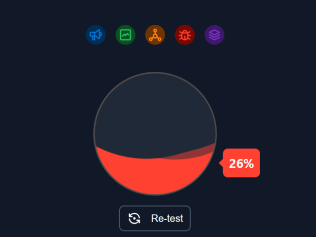
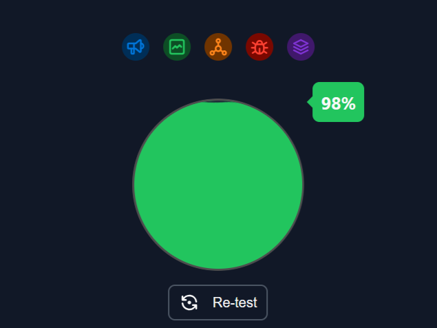

<html>
<head>
</head>
<body>
<h1>Pi-hole Adlists Repository</h1>

Welcome to the Pi-hole Adlists Repository! This repository contains a curated collection of various adlists that you can use with Pi-hole, a network-wide ad blocker that runs on your Raspberry Pi or Linux server. By adding these adlists to your Pi-hole configuration, you can enhance your ad blocking capabilities and enjoy a cleaner browsing experience.

<h2>How to Use</h2>

To use these adlists with Pi-hole, follow these steps:

<ol>
  <li><strong>Clone the Repository:</strong> Clone this repository to your local machine or server where Pi-hole is installed.</li>
  <pre><code>git clone https://github.com/yuneshwaran/AdBlocker.git</code></pre>
  <li><strong>Add Adlists to Pi-hole:</strong> Add the adlists from this repository to your Pi-hole configuration. You can do this by navigating to your Pi-hole's web interface, clicking on "Group Management" &gt; "Adlists", and then adding each adlist URL manually or by using the command-line interface.</li>
  <li><strong>Update Gravity:</strong> After adding the adlists, update Pi-hole's gravity to apply the changes and block the ads from the added lists.</li>
  <pre><code>pihole -g</code></pre>
  <li><strong>Optional: Regularly Update Adlists:</strong> It's recommended to regularly update the adlists in your Pi-hole configuration to ensure that you're blocking the latest ad domains and trackers.</li>
</ol>

<h2>How to Use the Regex Filter Script</h2>

To use the regex filter script with Pi-hole, follow these steps:

<ol>
  <li><strong>Prepare the Regex List File:</strong> Create a file named <code>regex.list</code> in the same directory as the script. This file should contain your regex filters, with each regex filter on a separate line.</li>
  <li><strong>Run the Script:</strong> Execute the Python script to add the regex filters to Pi-hole. Make sure Pi-hole is installed and running on your system.</li>
  <pre><code>python add_regex.py</code></pre>
  <li><strong>Restart Pi-hole DNS:</strong> After adding the regex filters, restart Pi-hole DNS to apply the changes and start blocking matching domains.</li>
  <pre><code>pihole restartdns</code></pre>
</ol>

  

    <h2 style=" margin-bottom: 5px">Without pi-hole</h2>
    
  

  

    <h2 style=" margin-bottom: 5px">With pi-hole</h2> 
    
  
   

<a href="https://d3ward.github.io/toolz/adblock">Adblocker Tester site</a>

<h2>Sources</h2>

 
  <ul>
    <li><a href="https://raw.githubusercontent.com/StevenBlack/hosts/master/hosts">Stock list</a></li>
    <li><a href="https://oisd.nl/">OISD</a></li>
    <li><a href="https://github.com/lightswitch05/hosts">DeveloperDan</a></li>
    <li><a href="https://github.com/blocklistproject/Lists">BlocklistProjects</a></li>
  </ul>

<h2>Disclaimer</h2>

Please note that while these adlists are curated to block advertisements and trackers, they may also block legitimate content on some websites. Use them at your own discretion. Additionally, Pi-hole is a powerful tool, but it's not a silver bullet for blocking all ads and trackers. Some ads may still get through, especially those served from the same domain as the content you're trying to access.

</body>
</html>
